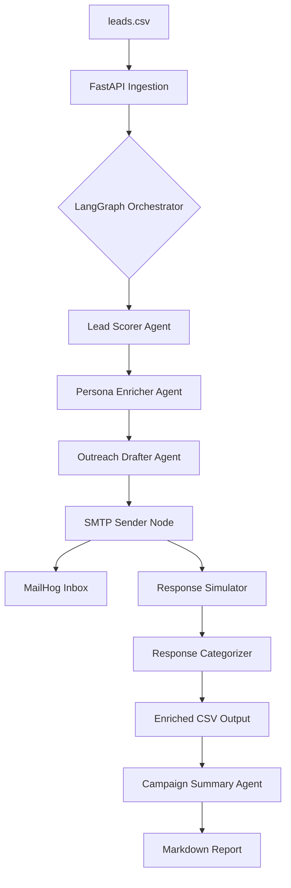

# NexusAI: Agentic Sales Campaign CRM 🤖🚀

NexusAI is a production-grade, autonomous sales outreach system built with a **Multi-Agent Orchestration** architecture. It transforms raw lead data into a fully executed sales campaign, complete with lead scoring, persona enrichment, personalized outreach, and simulated response categorization.

**Live Demo Context:** This system uses **LangGraph** to manage stateful agent transitions and **MailHog** for real-time SMTP observability.

---

## 🏗️ System Architecture

NexusAI follows a distributed, modular architecture designed for scalability and "Human-in-the-loop" extensibility.



---

## 🧠 The Agentic Workflow

The system utilizes six specialized agents to handle the end-to-end sales cycle:

1.  **Lead Scorer & Prioritizer:** Evaluates leads (1-10) based on job title, company size, and industry relevance.
2.  **Persona Enricher:** Predicts the psychological profile and professional pain points of the lead.
3.  **Outreach Drafter:** Crafts personalized, high-conversion HTML emails based on the lead's persona and priority.
4.  **SMTP Executor (Node):** A robust Python-based node that handles the handshake with the SMTP server for delivery.
5.  **Response Simulator:** Acts as the recipient to generate a realistic mock reply based on the persona.
6.  **Response Categorizer:** Analyzes the sentiment of the reply (Interested, Neutral, or Not Interested) to provide actionable CRM data.
7.  **Campaign Summarizer:** Aggregates all session data into an executive Markdown report.

---

## 🛠️ Tech Stack

*   **Orchestration:** [LangGraph](https://www.langchain.com/langgraph) (Stateful Multi-Agent workflows)
*   **Framework:** [LangChain](https://www.langchain.com/)
*   **LLMs:** Supported via **Groq** (Qwen32b) and **OpenAI** (GPT-4o-mini)
*   **API:** [FastAPI](https://fastapi.tiangolo.com/) (Asynchronous background tasks)
*   **Database/Storage:** Pandas (Persistence via Enriched CSV)
*   **Infrastructure:** Docker & Docker Compose
*   **Observability:** MailHog (SMTP Testing)

---

## 🚀 Getting Started

### Prerequisites
*   [Docker](https://www.docker.com/get-started) & Docker Compose installed.
*   An API Key from [Groq](https://console.groq.com/) or [OpenAI](https://platform.openai.com/).

### Installation & Setup

1.  **Clone the repository:**
    ```bash
    git clone https://github.com/MDalamin5/NexusAI-Agentic-Sales-Campaign-CRM.git
    cd NexusAI-Agentic-Sales-Campaign-CRM
    ```

2.  **Configure Environment Variables:**
    Rename `.env.example` to `.env` and add your keys:
    ```bash
    # Options: 'openai' or 'groq'
    # MODEL_PROVIDER=openai
    MODEL_PROVIDER=groq

    # Your API Keys (Replace with your actual keys)
    OPENAI_API_KEY=sk-your-openai-api-key (optional)
    GROQ_API_KEY=gsk_your_groq_api_key

    # --- SMTP CONFIGURATION ---
    # Use 'localhost' if running main.py directly on your machine.
    # Use 'mailhog' if running via Docker Compose.
    # SMTP_HOST=localhost
    SMTP_HOST=mailhog
    SMTP_PORT=1025
    SENDER_EMAIL=outreach@nexusai.com

    # --- DATA PATHS ---
    INPUT_CSV_PATH=data/lead.csv
    OUTPUT_CSV_PATH=data/enriched_leads.csv
    REPORT_PATH=reports/campaign_summary.md

    # This ensures logs appear in your terminal immediately
    PYTHONUNBUFFERED=1
    ```

3.  **Launch the System:**
    ```bash
    docker compose up --build
    ```

---

## 📊 Usage & Monitoring

### 1. Trigger the Campaign
Send a POST request to the FastAPI endpoint to start the autonomous pipeline:
```bash
curl -X POST http://localhost:8000/run-campaign
```

### 2. Monitor Observability (MailHog)
View all outgoing personalized emails in real-time by navigating to:
👉 **`http://localhost:8025`**

### 3. Review Outputs
*   **Enriched Data:** `data/enriched_leads.csv` (Includes priority, persona, and categorization).
*   **Executive Report:** `reports/campaign_summary.md` (AI-generated campaign insights).

---

## 🌟 Key Features
*   **DRY Architecture:** Centralized LLM factory and configuration management.
*   **Structured Output:** Strictly enforced Pydantic schemas for all AI agents.
*   **Bilingual Capability:** Designed to handle professional contexts across different regions.
*   **Closed-Loop Simulation:** Evaluates its own outreach effectiveness via simulated feedback nodes.

---

## 👤 Author
**Md Al Amin**  
Jr. AI Engineer  
[LinkedIn](https://linkedin.com/in/mdalamin5) | [GitHub](https://github.com/MDalamin5)
